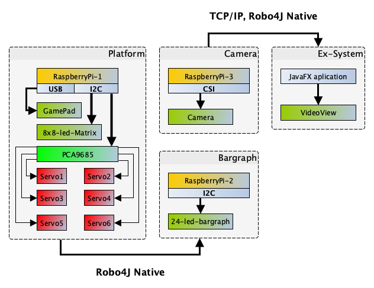

#Demo: Robotic Arm with Video Streaming
**T**he demo is a simple robotic arm controlled by
RaspberryPi Device. It uses the servo driver interface (PCA9685) to control 
all servos.The robotic arm is controlled by external Game Pad connected 
to the RaspberryPi over USB port (Logitech F710 WIRELESS). All main 
platform movements (gamepad movements) are emited to the another RaspberryPi 
system with connected bargraph. The bargraph display the the transmitted amount. 

The whole system is latter observer by the RaspberryPi camera. The video stream 
is displayed in JavaFX application. 

####Demo Schema:

####Requirements

1. Java 11+
2. Robo4J 0.5-SNAPSHOT
3. Pi4J 1.2 compiled for Java 11 and Pi4J V2 on Java 11+ 

References: 

[1. Adafruit 16-Channel 12-bit PWM/Servo Driver - I2C interface - PCA9685](https://www.adafruit.com/product/815)

[2. SainSmart 6-Axis Desktop Roboti Arm](https://www.sainsmart.com/products/6-axis-desktop-robotic-arm-assembled)

[3. RaspberryPi Camera Module V2](https://www.raspberrypi.org/products/camera-module-v2/)

[4. Adafruit Backpack: Bi-Color 24Bargraph](https://learn.adafruit.com/adafruit-led-backpack/bi-color-24-bargraph)

[5. Logitech F710: Wireless Gamepad](https://www.logitechg.com/en-roeu/products/gamepads/f710-wireless-gamepad.html)

[6. 3x RaspberryPi: 3+ versions with Java 11+](https://www.raspberrypi.org)